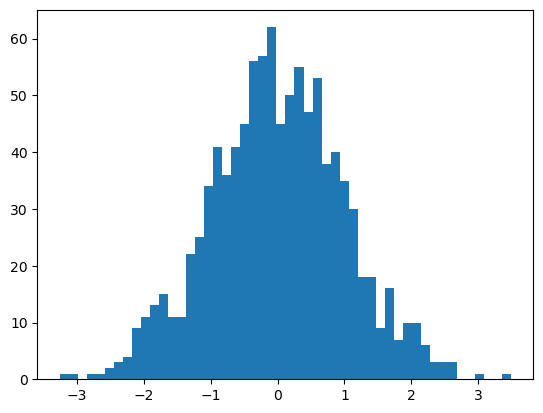

```python
import pandas as pd
import numpy as np
import matplotlib.pyplot as plt
```

# Data Analysis
Here, I have created a dataset and plotted it!

$$
5+5 = 9
$$


```python
X = np.random.normal(0,1, size=1000)
```


```python
_= plt.hist(X, bins=50)
```


    

    


```python
!jupyter nbconvert --to markdown First_notebook.ipynb
```

    [NbConvertApp] Converting notebook First_notebook.ipynb to markdown
    [NbConvertApp] Support files will be in First_notebook_files/
    [NbConvertApp] Writing 1806 bytes to First_notebook.md


```python

```
